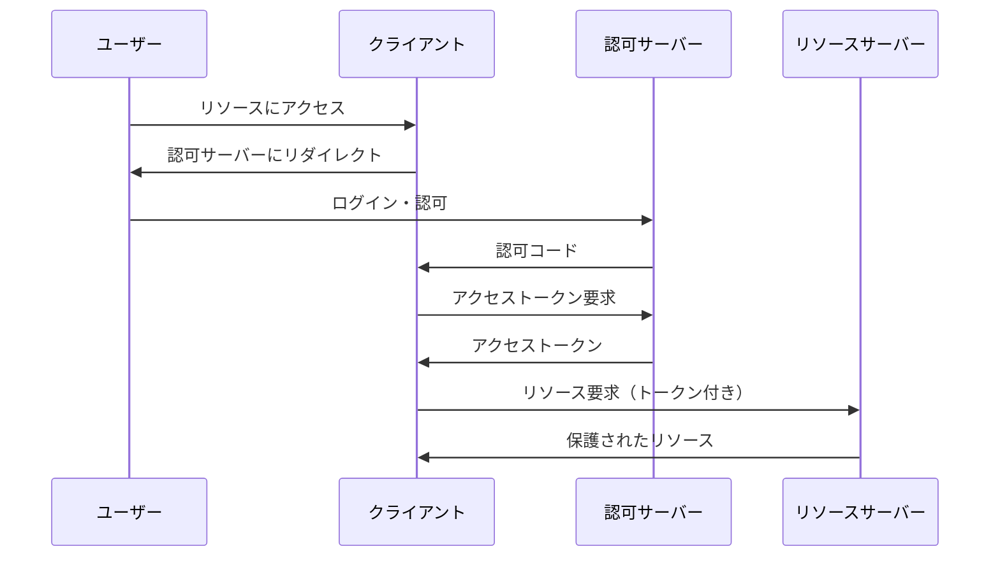
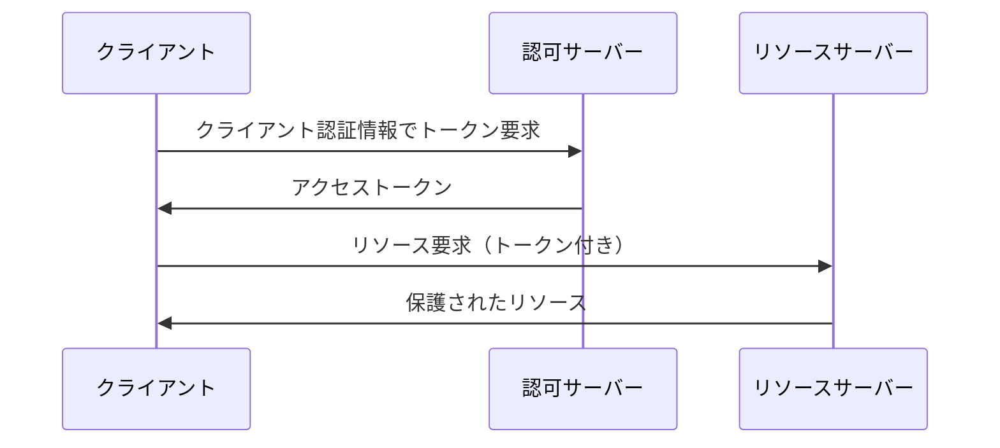
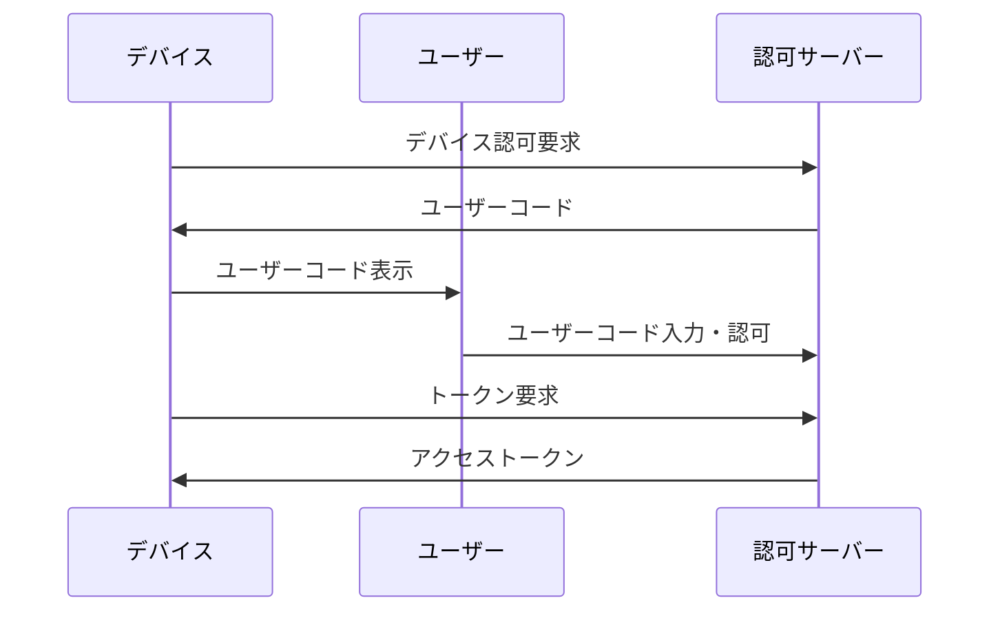

# OAuth 2.0の基本概念

OAuth 2.0は、アプリケーションがユーザーの代わりにリソースにアクセスするための認可フレームワークです。ユーザーのパスワードを共有することなく、限定的なアクセス権限を提供します。

## OAuth 2.0の主要な概念

### リソースオーナー（Resource Owner）
- 保護されたリソースへのアクセスを許可するエンティティ
- 通常はエンドユーザー（人）

### クライアント（Client）
- リソースオーナーの代わりに保護されたリソースを要求するアプリケーション
- Webアプリケーション、モバイルアプリ、デスクトップアプリなど

### 認可サーバー（Authorization Server）
- リソースオーナーを認証し、アクセストークンを発行するサーバー
- Authleteがこの役割を果たします

### リソースサーバー（Resource Server）
- 保護されたリソースをホストするサーバー
- アクセストークンを受け入れてリソースへのアクセスを許可

## OAuth 2.0フロー

### 1. 認可コードフロー（Authorization Code Flow）

最も安全で推奨されるフローです：

### 2. クライアント認証情報フロー（Client Credentials Flow）

サーバー間通信に使用：

### 3. デバイスフロー（Device Flow）

入力制限のあるデバイス用：

## トークンの種類

### アクセストークン（Access Token）
- 保護されたリソースにアクセスするために使用
- 有効期限が短い（通常1時間）
- ベアラートークンとして送信

### リフレッシュトークン（Refresh Token）
- 新しいアクセストークンを取得するために使用
- アクセストークンより長い有効期限
- 安全に保存する必要がある

### IDトークン（ID Token）
- OpenID Connectで使用
- ユーザーの認証情報を含むJWT
- アクセストークンとは別の目的

## スコープ（Scope）

アクセストークンがアクセスできるリソースの範囲を定義：

- `read` - 読み取り専用アクセス
- `write` - 書き込みアクセス
- `admin` - 管理アクセス
- カスタムスコープも定義可能

## セキュリティのベストプラクティス

### 1. HTTPSの使用
- すべての通信を暗号化
- トークンの傍受を防ぐ

### 2. ステートパラメータ
- CSRF攻撃を防ぐ
- 認可リクエストにランダムな値を含める

### 3. PKCE（Proof Key for Code Exchange）
- モバイルアプリやSPAでの認可コード傍受を防ぐ
- `code_challenge`と`code_verifier`を使用

### 4. トークンの適切な管理
- 安全なストレージ
- 適切な有効期限設定
- 定期的なローテーション

## Authleteでの実装

Authleteを使用すると、OAuth 2.0の複雑な実装を簡素化できます：

- **認可エンドポイント**: ユーザー認証と認可を処理
- **トークンエンドポイント**: アクセストークンの発行
- **イントロスペクションエンドポイント**: トークンの検証
- **リボケーションエンドポイント**: トークンの無効化

## 次のステップ

- [OpenID Connectの基本概念](/ja/concepts/oidc-basics)を学習
- [認可コードフローの実装](/ja/implementation/basic-oauth-flows)を試す
- [Authlete APIリファレンス](/ja/api-reference)で詳細を確認
