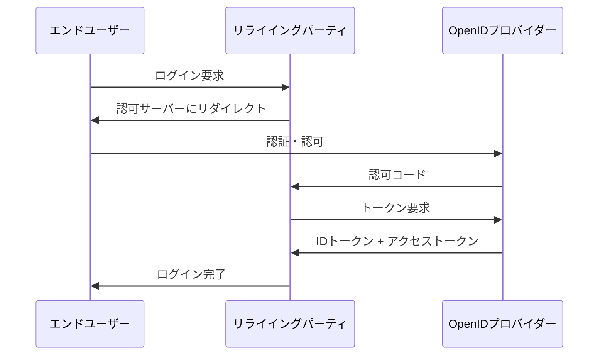
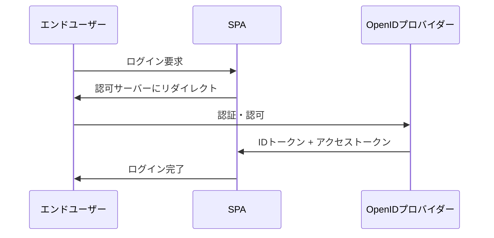

# OpenID Connectの基本概念

OpenID Connect（OIDC）は、OAuth 2.0の上に構築された認証レイヤーです。OAuth 2.0が認可（何にアクセスできるか）を提供するのに対し、OIDCは認証（誰であるか）を提供します。

## OpenID Connectの主要な概念

### エンドユーザー（End User）
- 認証される個人
- 通常はWebブラウザやモバイルアプリを使用

### リライイングパーティ（Relying Party, RP）
- エンドユーザーを認証したいアプリケーション
- OAuth 2.0のクライアントに相当

### OpenIDプロバイダー（OpenID Provider, OP）
- エンドユーザーを認証し、認証情報を提供するサーバー
- Authleteがこの役割を果たします

## OpenID Connectフロー

### 1. 認可コードフロー

最も安全で推奨されるフロー：



### 2. インプリシットフロー

SPA（Single Page Application）用：



## IDトークン

IDトークンは、ユーザーの認証情報を含むJWT（JSON Web Token）です：

### 標準クレーム

```json
{
  "iss": "https://authlete.com",
  "sub": "1234567890",
  "aud": "client_id",
  "exp": 1640995200,
  "iat": 1640908800,
  "nonce": "random_value"
}
```

- `iss` (issuer): トークンを発行したプロバイダー
- `sub` (subject): ユーザーの一意識別子
- `aud` (audience): トークンの対象クライアント
- `exp` (expiration): トークンの有効期限
- `iat` (issued at): トークンの発行時刻
- `nonce`: CSRF攻撃を防ぐランダム値

### 追加クレーム

```json
{
  "name": "田中太郎",
  "email": "tanaka@example.com",
  "email_verified": true,
  "picture": "https://example.com/photo.jpg"
}
```

## スコープ

OIDCでは特別なスコープを使用：

- `openid` - OIDC認証を有効にする（必須）
- `profile` - 基本プロファイル情報
- `email` - メールアドレス
- `address` - 住所情報
- `phone` - 電話番号

## UserInfoエンドポイント

認証されたユーザーの情報を取得：

```http
GET /userinfo HTTP/1.1
Authorization: Bearer ACCESS_TOKEN
```

レスポンス例：

```json
{
  "sub": "1234567890",
  "name": "田中太郎",
  "email": "tanaka@example.com",
  "email_verified": true,
  "picture": "https://example.com/photo.jpg"
}
```

## 検出（Discovery）

OIDC設定情報を自動取得：

```http
GET /.well-known/openid_configuration
```

レスポンス例：

```json
{
  "issuer": "https://authlete.com",
  "authorization_endpoint": "https://authlete.com/oauth/authorize",
  "token_endpoint": "https://authlete.com/oauth/token",
  "userinfo_endpoint": "https://authlete.com/oauth/userinfo",
  "jwks_uri": "https://authlete.com/.well-known/jwks.json",
  "response_types_supported": ["code", "id_token", "token"],
  "subject_types_supported": ["public"],
  "id_token_signing_alg_values_supported": ["RS256"]
}
```

## JWKS（JSON Web Key Set）

IDトークンの署名検証用の公開鍵：

```http
GET /.well-known/jwks.json
```

## セキュリティの考慮事項

### 1. トークンの検証
- 署名の検証
- 有効期限の確認
- 発行者（iss）の確認
- 対象（aud）の確認

### 2. ステートパラメータ
- CSRF攻撃を防ぐ
- 認可リクエストにランダムな値を含める

### 3. ノンス（Nonce）
- リプレイ攻撃を防ぐ
- 認可リクエストとIDトークンで同じ値を使用

### 4. HTTPSの使用
- すべての通信を暗号化
- トークンの傍受を防ぐ

## Authleteでの実装

Authleteを使用すると、OIDCの複雑な実装を簡素化できます：

- **認可エンドポイント**: ユーザー認証と認可を処理
- **トークンエンドポイント**: IDトークンとアクセストークンの発行
- **UserInfoエンドポイント**: ユーザー情報の提供
- **JWKSエンドポイント**: 公開鍵の提供
- **検出エンドポイント**: 設定情報の提供

## 実装例

### 認可リクエスト

```http
GET /oauth/authorize?
  response_type=code&
  client_id=CLIENT_ID&
  redirect_uri=https://example.com/callback&
  scope=openid profile email&
  state=random_state&
  nonce=random_nonce
```

### トークンリクエスト

```http
POST /oauth/token
Content-Type: application/x-www-form-urlencoded

grant_type=authorization_code&
code=AUTHORIZATION_CODE&
redirect_uri=https://example.com/callback&
client_id=CLIENT_ID&
client_secret=CLIENT_SECRET
```

## 次のステップ

- [OAuth 2.0の基本概念](/ja/concepts/oauth2-basics)を学習
- [IDトークンの処理](/ja/oidc/id-token-handling)を理解
- [UserInfoエンドポイント](/ja/oidc/userinfo-endpoint)の実装を確認
- [Authlete APIリファレンス](/ja/api-reference)で詳細を確認
