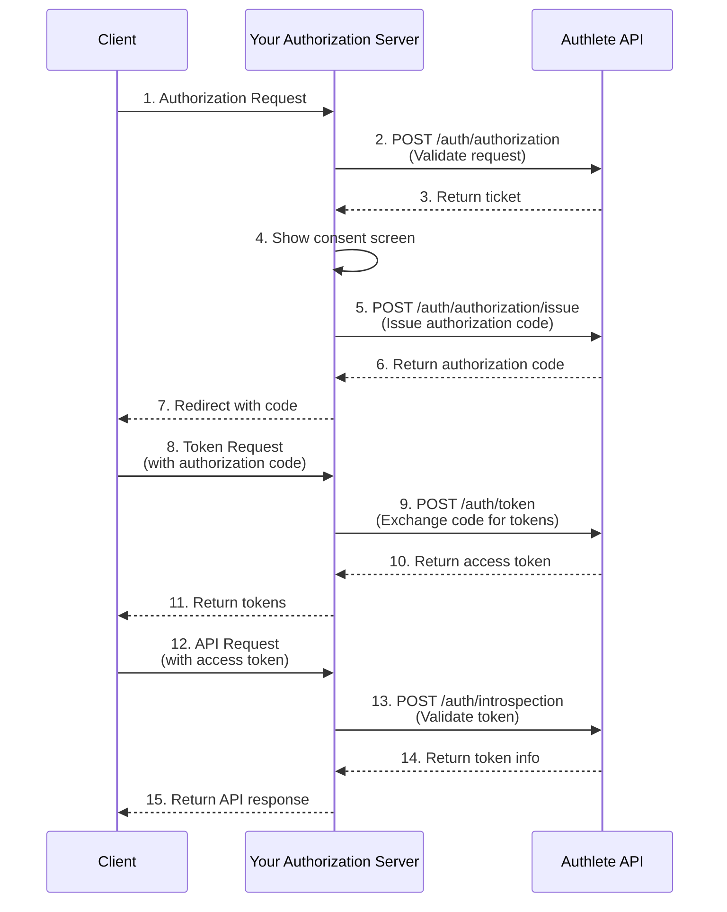

# Overview

Authlete provides the OAuth 2.0 and OpenID Connect logic your authorization server needs.

You run the endpoints, control the UX, manage user data, and decide how authentication and consent work. Authlete supplies the protocol-correct behavior through Web APIs that your server calls during each step of the OAuth/OIDC flow.

> Authlete is built for teams that want to operate their own identity layer without re-implementing OAuth and OpenID Connect.

---

## Authlete tools

- <svg width="16" height="16" viewBox="0 0 24 24" fill="none" stroke="#0057B7" stroke-width="2" stroke-linecap="round" stroke-linejoin="round" style={{ display: 'inline-block', verticalAlign: 'middle', marginRight: '0.5rem' }}><path d="M14 2H6a2 2 0 0 0-2 2v16a2 2 0 0 0 2 2h12a2 2 0 0 0 2-2V8z"></path><polyline points="14 2 14 8 20 8"></polyline><line x1="16" y1="13" x2="8" y2="13"></line><line x1="16" y1="17" x2="8" y2="17"></line></svg> **[APIs](/api-reference)** - REST endpoints that perform OAuth/OIDC validation, generate tokens, manage client metadata, introspect access tokens, and enforce security profiles. These APIs act as the protocol engine behind your authorization server.

- <svg width="16" height="16" viewBox="0 0 24 24" fill="none" stroke="#0057B7" stroke-width="2" stroke-linecap="round" stroke-linejoin="round" style={{ display: 'inline-block', verticalAlign: 'middle', marginRight: '0.5rem' }}><rect x="3" y="3" width="7" height="7"></rect><rect x="14" y="3" width="7" height="7"></rect><rect x="14" y="14" width="7" height="7"></rect><rect x="3" y="14" width="7" height="7"></rect></svg> **[Console](/tools/management-console)** - A management UI to configure services, register clients, define policies, review logs, and monitor traffic. The Console gives you operational control without changing your application code.

- <svg width="16" height="16" viewBox="0 0 24 24" fill="none" stroke="#0057B7" stroke-width="2" stroke-linecap="round" stroke-linejoin="round" style={{ display: 'inline-block', verticalAlign: 'middle', marginRight: '0.5rem' }}><polyline points="16 18 22 12 16 6"></polyline><polyline points="8 6 2 12 8 18"></polyline></svg> **SDKs & Client Libraries** - Official SDKs and client libraries for popular languages including TypeScript, Java, and Go. See the [SDK documentation](/sdk/typescript) for language-specific guides and code examples.

---

# Why use Authlete

  

    <svg width="20" height="20" viewBox="0 0 24 24" fill="none" stroke="#0057B7" stroke-width="2" stroke-linecap="round" stroke-linejoin="round" style={{ marginBottom: '0.75rem' }}><rect x="3" y="11" width="18" height="11" rx="2" ry="2"></rect><path d="M7 11V7a5 5 0 0 1 10 0v4"></path></svg>
    <h3 style={{ marginTop: 0, marginBottom: '0.25rem', fontSize: '1rem', fontWeight: 600 }}>Full control</h3>
    

      You define endpoints, UX, and branding. Authlete provides only the protocol engine behind your system.
    

  

  

    <svg width="20" height="20" viewBox="0 0 24 24" fill="none" stroke="#0057B7" stroke-width="2" stroke-linecap="round" stroke-linejoin="round" style={{ marginBottom: '0.75rem' }}><path d="M9 11l3 3L22 4"></path><path d="M21 12v7a2 2 0 0 1-2 2H5a2 2 0 0 1-2-2V5a2 2 0 0 1 2-2h11"></path></svg>
    <h3 style={{ marginTop: 0, marginBottom: '0.25rem', fontSize: '1rem', fontWeight: 600 }}>No OAuth/OIDC implementation</h3>
    

      Authlete handles validation, tokens, and security rules through APIs. No custom security code needed.
    

  

  

    <svg width="20" height="20" viewBox="0 0 24 24" fill="none" stroke="#0057B7" stroke-width="2" stroke-linecap="round" stroke-linejoin="round" style={{ marginBottom: '0.75rem' }}><path d="M12 22s8-4 8-10V5l-8-3-8 3v7c0 6 8 10 8 10z"></path></svg>
    <h3 style={{ marginTop: 0, marginBottom: '0.25rem', fontSize: '1rem', fontWeight: 600 }}>Broad standards coverage</h3>
    

      PKCE, PAR, JARM, CIBA, RAR, DPoP, FAPI, and more—all implemented behind Authlete's APIs.
    

  

  

    <svg width="20" height="20" viewBox="0 0 24 24" fill="none" stroke="#0057B7" stroke-width="2" stroke-linecap="round" stroke-linejoin="round" style={{ marginBottom: '0.75rem' }}><path d="M12 2L2 7l10 5 10-5-10-5z"></path><path d="M2 17l10 5 10-5"></path><path d="M2 12l10 5 10-5"></path></svg>
    <h3 style={{ marginTop: 0, marginBottom: '0.25rem', fontSize: '1rem', fontWeight: 600 }}>AI-ready</h3>
    

      Register OAuth clients programmatically for agent workflows with lightweight metadata.
    

  

---

## How Authlete fits into your system

  

    

      <svg width="20" height="20" viewBox="0 0 24 24" fill="none" stroke="#0057B7" stroke-width="2" stroke-linecap="round" stroke-linejoin="round"><circle cx="12" cy="12" r="10"></circle><path d="M12 6v6l4 2"></path></svg>
      <h3 style={{ margin: 0, fontSize: '1rem', fontWeight: 600 }}>Your Application</h3>
    

    
Exposes public endpoints:

    <ul style={{ marginTop: 0, marginBottom: '1rem', fontSize: '0.9rem' }}>
      <li><code>/authorize</code></li>
      <li><code>/token</code></li>
      <li>Additional OAuth/OIDC endpoints</li>
    </ul>
    
Handles:

    <ul style={{ marginTop: 0, fontSize: '0.9rem' }}>
      <li>User authentication and sessions</li>
      <li>Consent screens and UX</li>
      <li>Business logic and access decisions</li>
      <li>Final HTTP responses to clients</li>
    </ul>
  

  

    

      <svg width="20" height="20" viewBox="0 0 24 24" fill="none" stroke="#0057B7" stroke-width="2" stroke-linecap="round" stroke-linejoin="round"><rect x="3" y="3" width="18" height="18" rx="2" ry="2"></rect><line x1="9" y1="3" x2="9" y2="21"></line></svg>
      <h3 style={{ margin: 0, fontSize: '1rem', fontWeight: 600 }}>Authlete API</h3>
    

    
Sits behind your endpoints. Your server calls Authlete to:

    <ul style={{ marginTop: 0, fontSize: '0.9rem' }}>
      <li>Validate authorization and token requests</li>
      <li>Decide next action (authenticate, consent, error)</li>
      <li>Issue authorization codes and tokens</li>
      <li>Validate access tokens via introspection</li>
      <li>Enforce scopes, permissions, and security profiles</li>
    </ul>
  

<Info>
Authlete never communicates directly with end users or client applications. Your server defines the behavior; Authlete ensures it follows the specifications.
</Info>

---

### Architecture at a glance

---

## Flow overview

A typical authorization code flow with Authlete looks like this:

1. **Client → `/authorize`**  
   The client sends an authorization request to your authorization endpoint.

2. **`/authorize` → `POST /auth/authorization`**  
   Your server forwards the request parameters to Authlete for validation.

3. **Authlete → your server**  
   Authlete returns a ticket and an action (e.g. authenticate user, ask for consent, or return an error).

4. **Your server: authenticate + consent**  
   You authenticate the user and present a consent screen according to your UX and policy.

5. **`/authorize` → `POST /auth/authorization/issue`**  
   After consent is granted, your server asks Authlete to issue an authorization code.

6. **Authlete → your server → client**  
   Authlete returns the code; your server includes it in the redirect back to the client.

7. **Client → `/token`**  
   The client exchanges the authorization code at your token endpoint.

8. **`/token` → `POST /auth/token`**  
   Your server forwards the token request to Authlete.

9. **Authlete → your server → client**  
   Authlete returns access, refresh, and (optionally) ID tokens. Your server formats the HTTP response.

10. **Resource server → `POST /auth/introspection`**  
    When an API receives an access token, it sends it to Authlete for introspection (via your backend) and decides whether to honor the request.

This pattern generalizes across all supported flows such as PKCE, PAR, JARM, Device Flow, and CIBA.

---

## Responsibilities

  

    

      

        <svg width="18" height="18" viewBox="0 0 24 24" fill="none" stroke="#0057B7" stroke-width="2" stroke-linecap="round" stroke-linejoin="round"><path d="M22 11.08V12a10 10 0 1 1-5.93-9.14"></path><polyline points="22 4 12 14.01 9 11.01"></polyline></svg>
      

      <h3 style={{ margin: 0, fontSize: '1.05rem', fontWeight: 600 }}>You implement</h3>
    

    <ul style={{ margin: 0, paddingLeft: '1.25rem', fontSize: '0.9rem', lineHeight: 1.7 }}>
      <li>Public OAuth/OIDC endpoints (e.g. <code>/authorize</code>, <code>/token</code>)</li>
      <li>Login, consent, and session management flows</li>
      <li>User and application data models</li>
      <li>Business-specific logic and policies</li>
      <li>Final HTTP responses and error formats</li>
    </ul>
  

  

    

      

        <svg width="18" height="18" viewBox="0 0 24 24" fill="none" stroke="#0057B7" stroke-width="2" stroke-linecap="round" stroke-linejoin="round"><path d="M12 22s8-4 8-10V5l-8-3-8 3v7c0 6 8 10 8 10z"></path></svg>
      

      <h3 style={{ margin: 0, fontSize: '1.05rem', fontWeight: 600 }}>Authlete provides</h3>
    

    <ul style={{ margin: 0, paddingLeft: '1.25rem', fontSize: '0.9rem', lineHeight: 1.7 }}>
      <li>OAuth/OIDC parameter and request validation</li>
      <li>Token generation and lifecycle management</li>
      <li>Scope, client, and policy enforcement</li>
      <li>Token introspection and revocation</li>
      <li>Standards-compliant protocol behavior as specifications evolve</li>
    </ul>
  

---

## Supported standards

Authlete provides API-level support for a wide range of OAuth 2.0, OpenID Connect, identity federation, credential issuance, and modern security extensions. All capabilities are accessed through a unified Web API surface.

  

    <h4 style={{ marginTop: 0, marginBottom: '0.75rem', fontSize: '0.95rem', fontWeight: 600, color: '#0057B7' }}>OAuth 2.0 & OIDC Core</h4>
    <ul style={{ margin: 0, paddingLeft: '1.25rem', fontSize: '0.85rem', lineHeight: 1.8 }}>
      <li>Authorization Code, Hybrid, Implicit flows</li>
      <li>PKCE</li>
      <li>ID Token and UserInfo handling</li>
      <li>Token introspection & revocation</li>
      <li>Native SSO</li>
    </ul>
  

  

    <h4 style={{ marginTop: 0, marginBottom: '0.75rem', fontSize: '0.95rem', fontWeight: 600, color: '#0057B7' }}>Modern OAuth Extensions</h4>
    <ul style={{ margin: 0, paddingLeft: '1.25rem', fontSize: '0.85rem', lineHeight: 1.8 }}>
      <li>PAR, JARM, DPoP, RAR</li>
      <li>Device Flow</li>
      <li>CIBA</li>
      <li>Dynamic Client Registration</li>
    </ul>
  

  

    <h4 style={{ marginTop: 0, marginBottom: '0.75rem', fontSize: '0.95rem', fontWeight: 600, color: '#0057B7' }}>Federation & Credentials</h4>
    <ul style={{ margin: 0, paddingLeft: '1.25rem', fontSize: '0.85rem', lineHeight: 1.8 }}>
      <li>OIDC Federation 1.0</li>
      <li>Verifiable Credentials (OID4VCI)</li>
      <li>AI agent client registration</li>
    </ul>
  

  

    <h4 style={{ marginTop: 0, marginBottom: '0.75rem', fontSize: '0.95rem', fontWeight: 600, color: '#0057B7' }}>Financial-Grade</h4>
    <ul style={{ margin: 0, paddingLeft: '1.25rem', fontSize: '0.85rem', lineHeight: 1.8 }}>
      <li>FAPI 1.0 & 2.0</li>
      <li>mTLS</li>
      <li>Regulated environment profiles</li>
    </ul>
  

  

    <h4 style={{ marginTop: 0, marginBottom: '0.75rem', fontSize: '0.95rem', fontWeight: 600, color: '#0057B7' }}>Signing & Keys</h4>
    <ul style={{ margin: 0, paddingLeft: '1.25rem', fontSize: '0.85rem', lineHeight: 1.8 }}>
      <li>JWK, JWKS, key rotation</li>
      <li>HSM-backed signing</li>
      <li>Algorithm enforcement</li>
    </ul>
  

  

    <h4 style={{ marginTop: 0, marginBottom: '0.75rem', fontSize: '0.95rem', fontWeight: 600, color: '#0057B7' }}>OpenID Certified</h4>
    <ul style={{ margin: 0, paddingLeft: '1.25rem', fontSize: '0.85rem', lineHeight: 1.8 }}>
      <li>Basic, Implicit, Hybrid OP</li>
      <li>Config, Dynamic, Form Post OP</li>
      <li>FAPI-aligned certifications</li>
    </ul>
  

  

    <h4 style={{ marginTop: 0, marginBottom: '0.75rem', fontSize: '0.95rem', fontWeight: 600, color: '#0057B7' }}>Enterprise</h4>
    <ul style={{ margin: 0, paddingLeft: '1.25rem', fontSize: '0.85rem', lineHeight: 1.8 }}>
      <li>SAML 2.0 for SSO</li>
    </ul>
  

<Info>
Authlete integrates with your HSM or signing backend rather than hosting your keys.
</Info>

**Learn more**

For flow-by-flow details, see the [Flows & Protocol Guides](/flows/device-flow).

---

## Next steps

- Start with the **Quickstart** to implement a minimal OAuth 2.0 authorization server.  
- Explore the **API Reference** for endpoint-by-endpoint integration details.  
- Review the **Flows & Protocol Guides** to see how Authlete supports specific profiles such as PKCE, FAPI, and CIBA.
